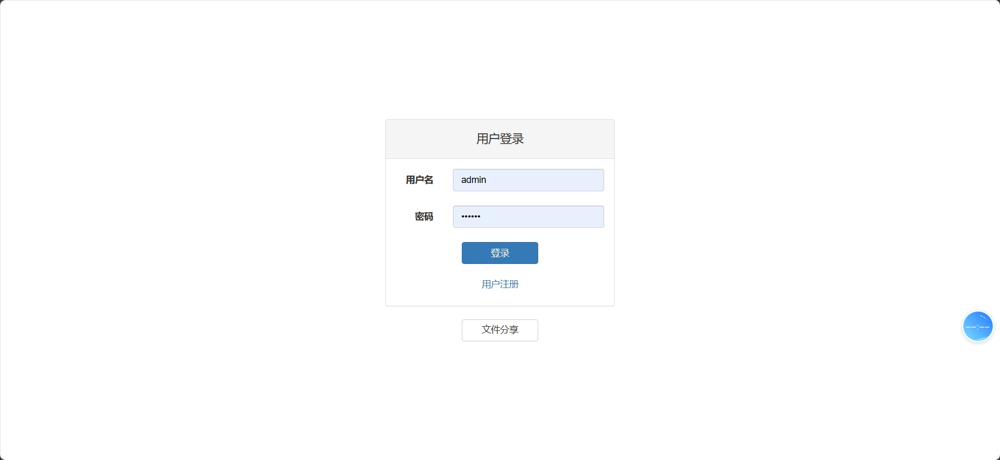
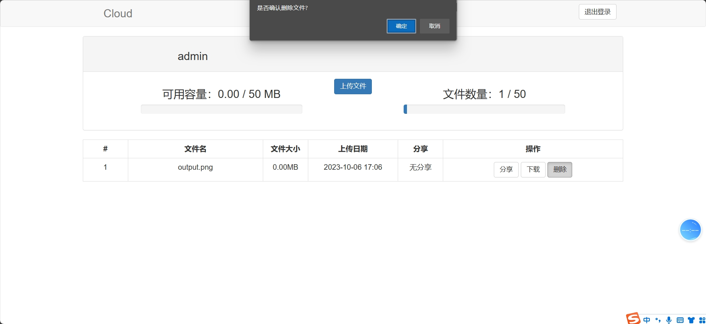
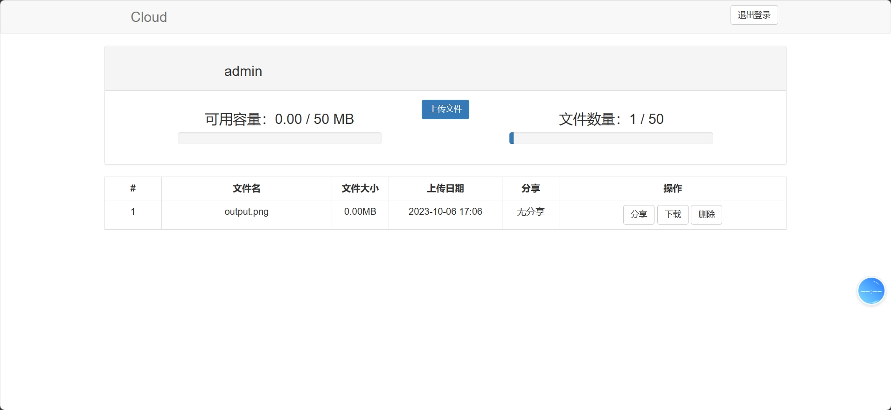
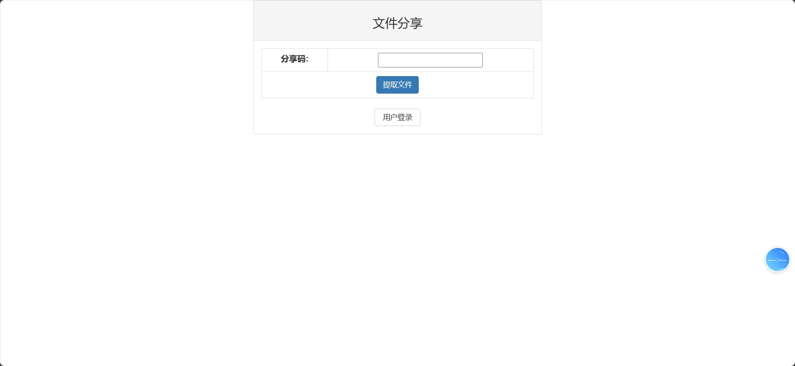
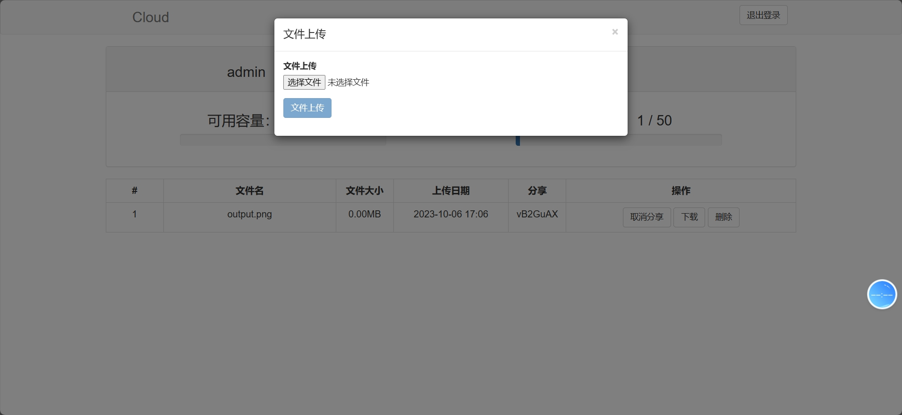
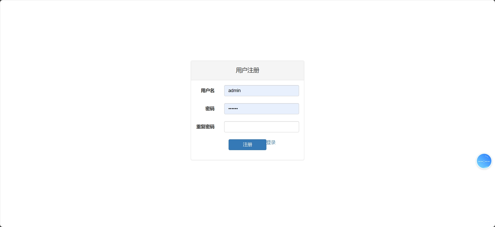

<h1 align="center">基于SSM框架的网盘系统</h1>

 获取sql文件 QQ: 3645296857 QQ群: 978300347 

<h4> 需要视频演示可联系上述QQ，私发视频链接 </h4>

 获取更多高质量源码，请访问：[mzoo源码网](https://mzoocodes.com/)

## 简介

> 本代码来源于网络,仅供学习参考使用!
>
> <b style="color: dodgerblue"> 提供1.远程部署/2.修改代码/3.定制程序/4.文档指导/5.框架代码讲解、技术解答、代码讲解等服务 </b>
>
> 前端地址：http://localhost:8080/
>
> 用户：admin 密码: 123456

## 项目介绍

基于SSM框架的网盘系统：前端 Jsp、BootStrap、JQuery、Ajax，后端 SpringMVC、Mybatis，系统角色分为：用户，用户对网盘进行管理等。主要功能如下：

### 用户：

- 基本操作：登录、注册
- 其他操作：上传文件、分享文件、下载文件、删除文件、获取文件列表、获取文件信息详情

## 环境

- <b>IntelliJ IDEA 2020.3</b>

- <b>Mysql 5.7.26</b>

- <b>Tomcat 9.0.41</b>

- <b>Maven 3.6.3</b>

- <b>JDK 1.8</b>

## 运行截图

